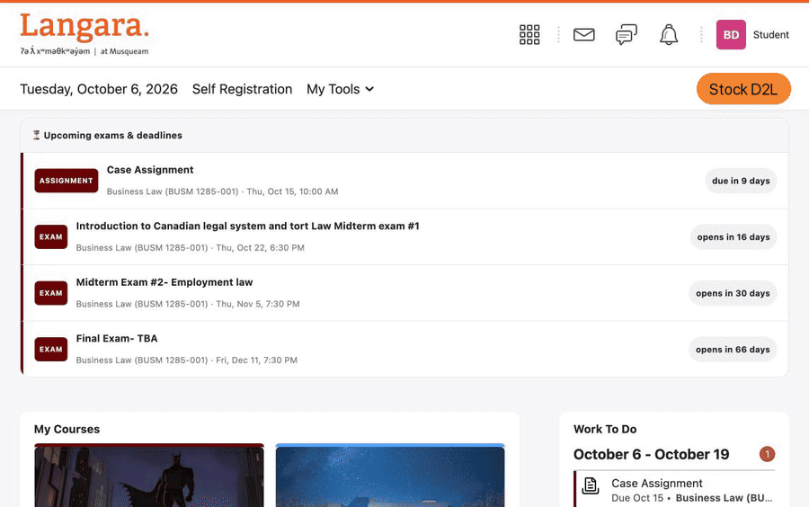
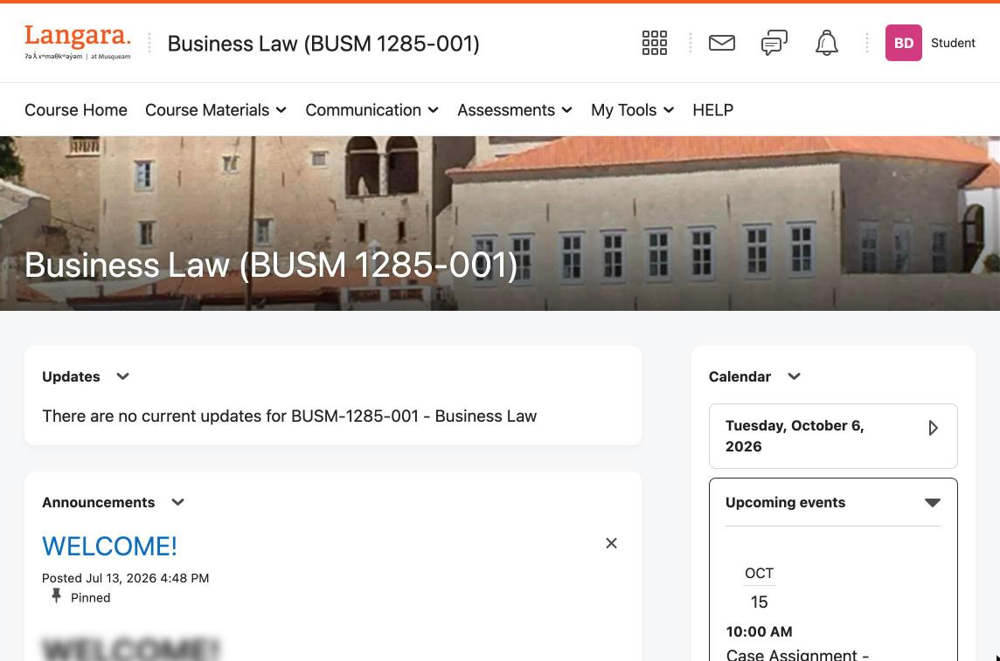
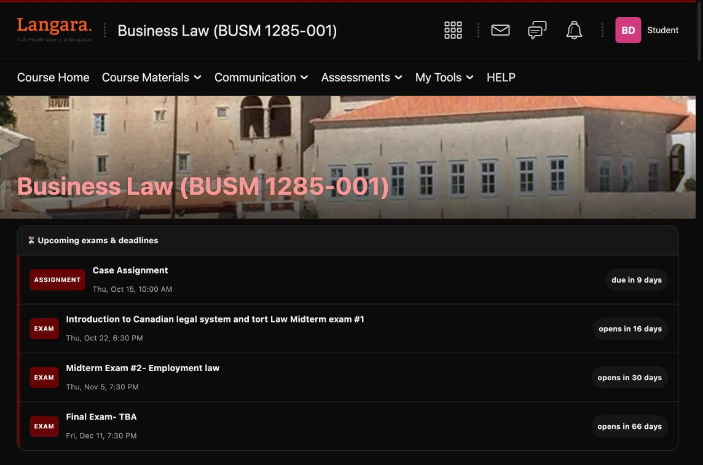
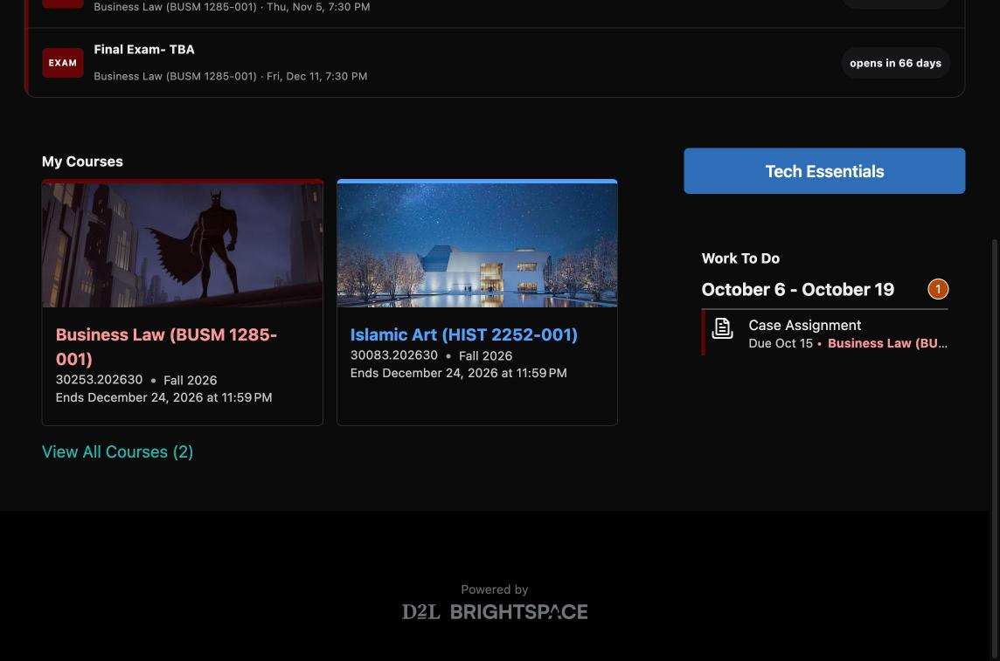
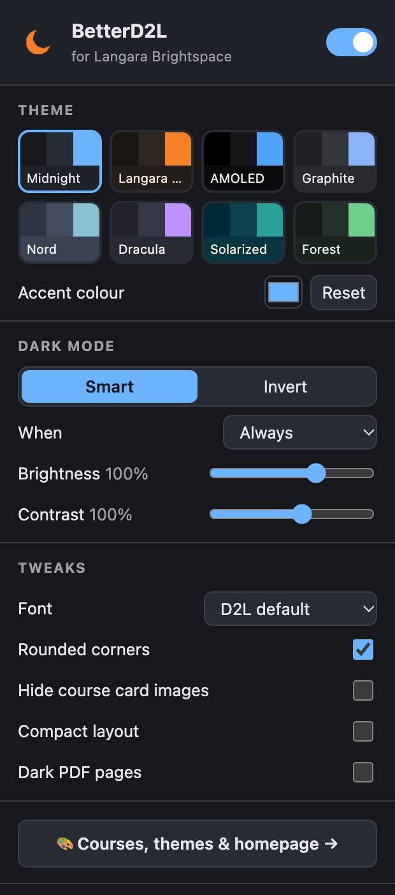
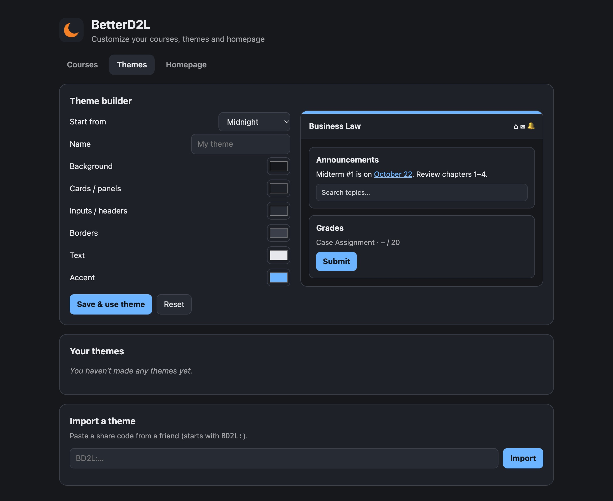
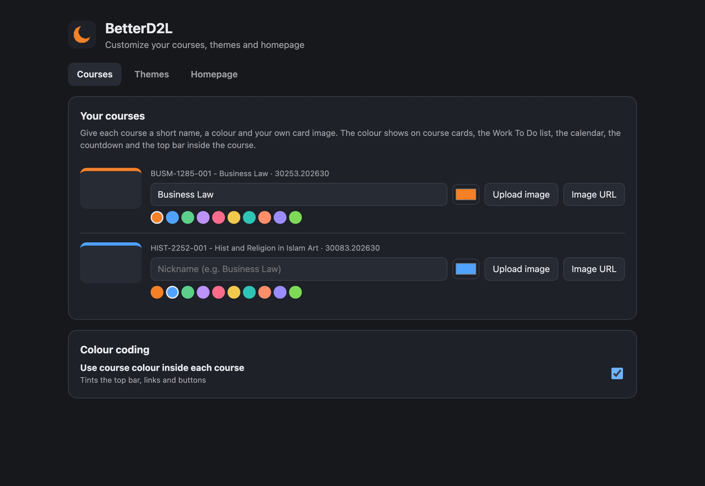
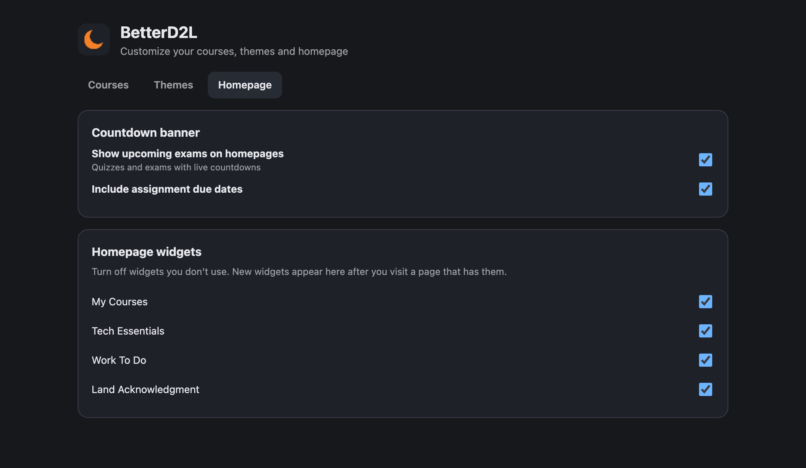
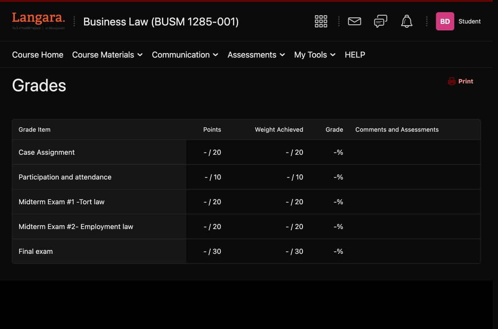

<div align="center">


# BetterD2L

**Dark mode, themes and real upgrades for Langara D2L (Brightspace).**
Like [BetterCanvas](https://github.com/ksucpea/bettercanvas), but for D2L.




**[🌐 Website](https://cryptochefa.github.io/betterd2l/)** · **[⬇️ Download](https://github.com/CryptoChefA/betterd2l/releases/latest/download/betterd2l.zip)** · **[📝 Changelog](CHANGELOG.md)**

</div>

Langara's D2L (Brightspace, at `d2l.langara.bc.ca`) has no dark mode. **BetterD2L** is a free, open-source Chrome extension that adds one, plus themes, exam countdowns, custom course cards and colour coding. It's the BetterCanvas experience for Langara College students.

<div align="center">

</div>

---

## ✨ Features

### 🌙 Dark mode that actually works
- **Smart mode** recolours D2L's own design tokens, then a colour fixer repairs everything else: hard-coded white panels, the audio player, instructor-written announcements, calendar widgets, and legacy pages that live in shadow DOM or iframes where normal CSS can't reach.
- **Invert mode** is a fallback for pages where nothing else works.
- **9 built-in themes**: Midnight, Langara Night, AMOLED, Graphite, Nord, Dracula, Solarized, Forest and Rosé 🌸. You can pick any accent colour on top.
- **Scheduling**: always on, follow your system setting, or a time window (e.g. 7 PM to 7 AM).
- Brightness and contrast sliders, plus an optional **dark PDF pages** mode.
- **Smooth transitions**: switching themes or turning dark mode on or off crossfades the whole page instead of snapping (respects *Reduce motion*).
- Press <kbd>Alt</kbd> + <kbd>Shift</kbd> + <kbd>D</kbd> anywhere to toggle it.

<table>
<tr>
<th>Before</th>
<th>After</th>
</tr>
<tr>
<td></td>
<td></td>
</tr>
</table>

### ⏳ Exam & deadline countdown
A banner on your homepage and on every course homepage lists upcoming quizzes, exams and assignment due dates, for example *"Midterm Exam #1 · Thu Oct 22, 6:30 PM · opens in 16 days"*.
- Dates come straight from D2L, so nothing needs to be entered by hand.
- Countdowns turn **orange** under 3 days and **red** under 24 hours.
- Each row links straight to the quiz or assignment.

### 🎨 Custom course cards
Rename courses (*"BUSM-1285-001 - Business Law 30253.202630"* becomes *"Business Law"*), give each one a colour, and set your own image by uploading a picture or pasting a link. It replaces both the course card and the banner on the course homepage.



### 🌈 Colour coding everywhere
Each course's colour follows it around:
- the course cards
- the **Work To Do** list
- the **Calendar**
- the countdown banner
- inside the course, where the top band, links and buttons take the course colour

Your nicknames also replace the long course names in the top bar and the browser tab title.

### 🖌️ Make your own themes
Click the **+ Create** tile in the popup, or try the [theme maker on the website](https://cryptochefa.github.io/betterd2l/#make). Build your own palette with a live preview. Click **Copy share code** to get a code like `BD2L:eyJuYW1l…` you can send to friends, who paste it into **Import a theme** to get the same look.

### 🧹 Hide clutter
Turn off homepage widgets you never use, such as Tech Essentials, Land Acknowledgment or LSM Resources. New widgets are added to the list automatically as you visit pages.

### 🛠️ Extra tweaks
Font choices (System, Rounded, Monospace, Dyslexia-friendly), rounded corners, a compact layout, and hiding course card images.

---

## 📸 Screenshots

<table>
<tr>
<td width="32%"></td>
<td></td>
</tr>
<tr>
<td align="center"><b>Popup</b>: quick theme, mode and tweaks</td>
<td align="center"><b>Theme builder</b>: live preview and share codes</td>
</tr>
</table>

<table>
<tr>
<td></td>
<td></td>
</tr>
<tr>
<td align="center"><b>Courses</b>: nicknames, colours and images</td>
<td align="center"><b>Homepage</b>: countdown and widget toggles</td>
</tr>
</table>



---

## 📦 Install

BetterD2L isn't on the Chrome Web Store yet, so you load it in developer mode. It takes about a minute.

1. **Download** [**betterd2l.zip**](https://github.com/CryptoChefA/betterd2l/releases/latest/download/betterd2l.zip) (always the latest version) and unzip it.
   (Or click **Code → Download ZIP**, or run `git clone https://github.com/CryptoChefA/betterd2l.git`.)
2. Open **`chrome://extensions`** in Chrome.
3. Turn on **Developer mode** (top-right switch).
4. Click **Load unpacked** and select the `betterd2l` folder (the one containing `manifest.json`).
5. Open [d2l.langara.bc.ca](https://d2l.langara.bc.ca) and it goes dark straight away. 🌙

> **Tip:** click the 🧩 puzzle icon in Chrome's toolbar and pin BetterD2L so the moon icon is always visible.

It also works in other Chromium browsers (Edge, Brave, Arc, Opera) the same way.

### Updating
Download the new version from [Releases](https://github.com/CryptoChefA/betterd2l/releases) (see the [changelog](CHANGELOG.md) for what's new), replace the folder's contents, then click **↻** on the BetterD2L card in `chrome://extensions`. Your settings are kept.

---

## 🚀 Using it

| Where | What you can do |
|---|---|
| **Toolbar popup** (moon icon) | Turn dark mode on or off, pick a theme or accent colour, switch Smart/Invert, schedule, brightness/contrast, fonts and tweaks |
| **Settings page** (popup → *Courses, themes & homepage*) | Course nicknames, colours and images; theme builder and share codes; countdown options; widget toggles |
| **Keyboard** | <kbd>Alt</kbd> + <kbd>Shift</kbd> + <kbd>D</kbd> toggles dark mode (change it at `chrome://extensions/shortcuts`) |

**Something still looks bright?** Switch to **Invert** in the popup for that page, and please [open an issue](https://github.com/CryptoChefA/betterd2l/issues) with the page name.

---

## 🔒 Privacy

- **No tracking, no analytics, no servers.** BetterD2L never sends your data anywhere.
- It only runs on `d2l.langara.bc.ca` (and `brightspace.langara.ca`).
- To show your courses and countdowns, it reads D2L's own API **from inside your logged-in D2L tab**, the same requests D2L's own pages make. Nothing leaves your browser.
- Settings are stored in Chrome's storage. Course nicknames, colours and themes sync between your own Chrome browsers, and uploaded card images stay on your device.

More detail: [docs/PRIVACY.md](docs/PRIVACY.md).

---

## 🧑‍💻 For developers

```
betterd2l/
├── manifest.json      # MV3 manifest
├── themes.js          # shared: themes, defaults, palette → D2L token mapping, share codes
├── content.js         # dark mode engine: attributes, token overrides, colour fixer
├── features.js        # course cards, nicknames/colours, countdown, widget hiding
├── betterd2l.css      # Smart/Invert styles, tweaks, countdown banner
├── background.js      # keyboard shortcut handler
├── popup.html/css/js  # toolbar popup
├── options.html/css/js# full settings page
├── icons/
└── docs/              # website (GitHub Pages), screenshots, docs
```

How it works, and how to debug a page that still looks bright: [docs/ARCHITECTURE.md](docs/ARCHITECTURE.md). Contributions are welcome; see [CONTRIBUTING.md](CONTRIBUTING.md).

### Other schools
BetterD2L targets Langara, but most of it is plain Brightspace. To try it at another school, add your D2L domain to `content_scripts.matches` in `manifest.json` and reload the extension.

---

## ⚖️ Disclaimer

BetterD2L is an independent student project. It is **not affiliated with, endorsed by, or supported by Langara College or D2L Corporation**. "Brightspace" and "D2L" are trademarks of D2L Corporation. If something looks wrong in D2L, turn BetterD2L off before contacting Langara IT.

Released under the [MIT License](LICENSE).
